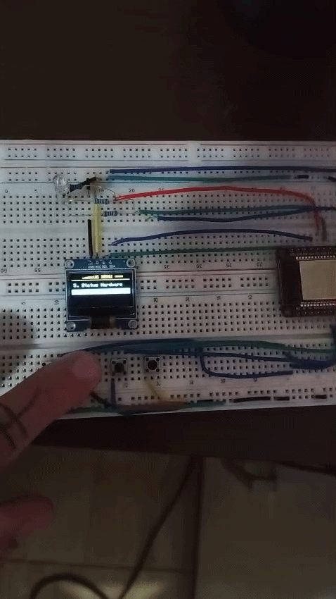

#DeckOS (Cyberceck) ESP-32

##Um pequeno projeto pessoal, desenvolvido através da ideia dos cyberdecks, para treinar praticas de programação e eletronica.

**Equipamentos utilizados**
- Microcontrolador ESP32
- Display OLED I2C 128x64 (SSD1306)
- 4 Push Buttons
- Buzzer
- 1 Led RGB

**Bibliotecas Utilizadas:**
- `WiFi.h`
- `WebServer.h`
- `Preferences.h`
- `Adafruit_SSD1306`
- `Adafruit_GFX`
